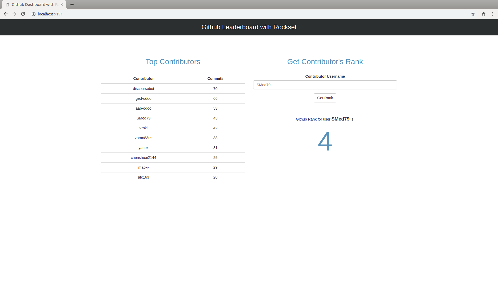

# Github Leaderboard

[GitHub Archive](https://github.blog/2012-05-01-data-at-github/ "GitHub Archive") is a project to record the public GitHub timeline, archive it on an hourly basis, and make it easily accessible for further analysis. The following steps will guide you to bring Github Archive data into AWS S3 and further into Rockset.
This project also provides steps to deploy `Github Leaderboard` app on top Rockset collection.

## Import Github Archive Data into S3

### Prerequisites
- Python 3.6+
- Python Virtual Environment (Optional)

### Steps to run
1. Clone the repository
```
git clone git@github.com:rockset/recipes.git
cd recipes/github-leaderboard/
```
2. Create and activate Python virtual environment `github-demo` and install all the Python dependencies.
```
python3 -m venv github-demo
source github-demo/bin/activate
pip install awscli rockset
```
3. Configure AWS CLI
```
aws configure
AWS Access Key ID [None]: YOUR-ACCESS-KEY
AWS Secret Access Key [None]: YOUR-SECRET-KEY
Default region name [None]: us-west-2
Default output format [None]: json
```
4. Create an S3 Bucket where the github data is temporarily stored. In this example, the name of the bucket is 'rockset-github-rank'. 
```
aws s3 mb s3://rockset-github-rank
```
5. Configure the rock CLI client with your Rockset API key.
```
rock configure --api_key <YOUR-API-KEY>
```
6. Create a Rockset Integration. We can access and ingest the data when creating a collection.
```
rock create integration "aws-rockset" --type=AWS --aws_access_key_id="YOUR-ACCESS-KEY" --aws_secret_access_key="YOUR-SECRET-KEY"
```

7. `github-s3-uploader.sh` script will bring a Github Archive data into an S3 bucket. Open config.env file in an editor and adjust the name of your bucket and dates for which you want to import data for.
```
MIN_DATE= # Start uploading data from this date
MAX_DATE= # Upload data till this date - inclusive
S3_PATH=s3://rockset-github-rank/github-data/
```

8. Run an uploader script.
```
./github-s3-uploader.sh
```

9. Create a Rockset Collection github via aws-rockset integration using github-data residing in the AWS S3 bucket that you created in Step 4 earlier. If this command fails with the message "has zero s3 objects", then wait for sometime for the uploader script to start populating the S3 bucket and re-run this command.
```
rock create collection github s3://rockset-github-rank/github-data --integration=aws-rockset
```

10. Console logs will show the upload progress. Also `s3://rockset-data/github-data/meta.txt` records the date till which data is uploaded.

11. As we have already created a Rockset collection, data ingest would start as soon as files are uploaded into an S3 bucket. You can monitor the data ingestion progress. **fill_progress** will reach to 1 when the data load completes. 
```
rock describe collection github
…
…
stats: {currentProgress: null, doc_count: 38463471, fill_progress: 0.354, last_queried_ms: 1548843110490,
    last_updated_ms: 1548843712954, total_size: 108532054774}
…
```

## Github Leaderboard App

This is simple servless app which enables user to find his github rank. This guide assumes you are familiar with AWS Lambda and [Serverless](https://serverless.com/framework/docs/providers/aws/guide/installation/).

1. [Install](https://nodejs.org/en/download/) Node on your machine.

1. Install Serverless `npm install -g serverless`

1. Install all serverless dependencies `npm install`

1. Update `ROCKSET_APISERVER` and `ROCKSET_APIKEY` in `config.env`.

1. Deploy code to AWS Lambda `sls deploy`. It should deploy the Python code to AWS Lambda and create a API Endpoints on it. You should see an output containing
    ```
    ...
    endpoints:
      GET - https://<string>.amazonaws.com/dev/contributors
      GET - https://<string>.amazonaws.com/dev/rank/{username}
    ...
    ```
1. Get Top 10 Contributors
    ```
    curl https://<string>.amazonaws.com/dev/contributors
    
    [
      {
        "Contributor": "discoursebot",
        "Commits": 70
      },
      {
        "Contributor": "ged-odoo",
        "Commits": 66
      },
      ...
    ]
    ```
1. Get Github Rank of a specific user
    ```
    curl curl https://<string>.amazonaws.com/dev/rank/discoursebot
    
    [
      {
        "Rank": 1
      }
    ]
    ```
1. The API base path is `https://<string>.amazonaws.com/dev/`

1. Now, we can run a UI app which will show us top 10 contributors and also help you to find your own github rank.

1. Open a file [script.js](./js-app/assets/js/script.js). Change the `BASE_URL` with BASE_URL mentioned in above step.

1. Run a simple HTTP server
    ```
    cd js-app
    python3 -m http.server 9191
    ```
1. Click [here](http://localhost:9191/)


